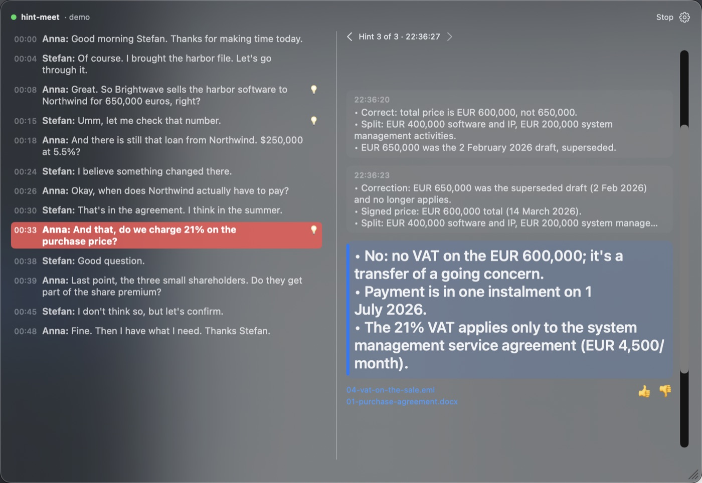
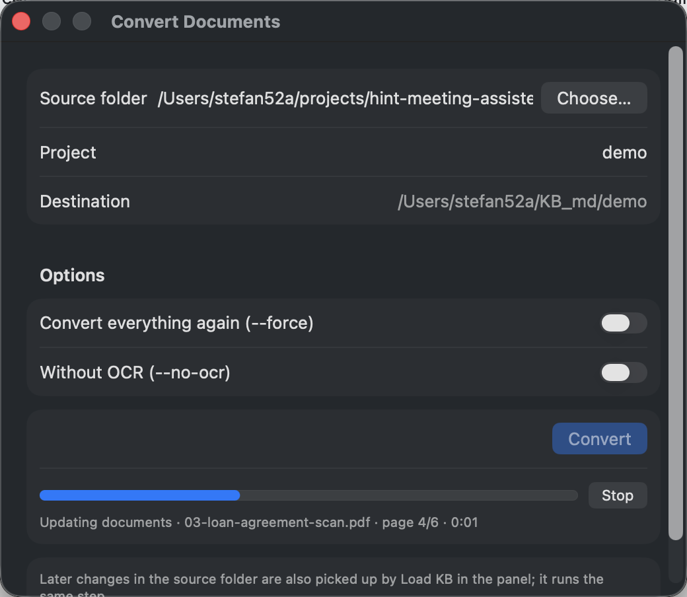

# hint-meet

HintMeet is a meeting copilot for the Mac. It listens along during a conversation, recognizes the moment you need something from your own files, and within a few seconds puts a short hint on your screen: 1 to 4 bullet points, with the source. Afterwards it writes a report with action items.

**What it's for.** Conversations where details from a large dossier matter: with a tax advisor, notary, bank, buyer or shareholder. Someone mentions an amount, date or agreement that isn't right, or asks a question whose answer is somewhere in your documents. HintMeet finds that document and briefly says what actually applies, so you don't have to search or guess.

**How to use it.**
1. Turn a folder of documents (PDF, Word, Excel, mail, scans, …) into a knowledge base: *Add Folder…* in the knowledge base menu, *Convert Documents* in the app, or `tools/kb_prep.py`. **The first time can take a long time**: every passage is embedded once (hours for very large folders); HintMeet warns you and shows the estimated time. You can stop and continue later with *Preload KB*; after that, loading takes seconds.
2. In HintMeet, select one or more projects and click *Preload KB*, **well before the meeting**: the first time, embedding the documents can take hours (days for very large folders). After that the meeting starts right away; the button only appears when something needs loading.
3. Optionally fill in *Meeting info* (with whom, where), choose the language of the conversation, and start the meeting. Hints appear in a floating panel above your meeting without taking over your keyboard. The transcript runs alongside; ◀ ▶, scrolling or clicking takes you back to earlier hints.
4. Afterwards the report with action items is in `<KB>/meetings/`; the transcript is in `logs/`.
5. Looking for a document? *Find Documents* (⌘F) searches the knowledge base by content (words, amounts, names, topics) and opens the original file.



*During a (fictional) English meeting: Anna asks whether 21% VAT is charged; HintMeet answers from the dossier that the sale is a transfer of a going concern, with the e-mail and the agreement as sources.*



*Building the knowledge base: Convert Documents reads Word, PDF (including scans via OCR), e-mail and Excel into Markdown.*

Speech recognition (Whisper via MLX), the knowledge base and search run locally. During the meeting, the last few turns of the conversation plus the passages found go to the language models (gatekeeper and Claude); afterwards the full transcript goes to Claude for the report (can be turned off in Settings or with `--no-summary`).

Conversations can be in any of the 100 languages Whisper knows (Dutch, English, German, French, Spanish, Chinese, …), or multilingual (language recognized per speaker). Hints and the report follow the language of the conversation.

> Status: working prototype (Python pipeline + macOS app). Changes per day are in [CHANGELOG.md](CHANGELOG.md).

## How it works

```
microphone + system audio (BlackHole)
        │
        ▼
audio.py        Silero VAD (utterance ends after 400 ms silence) + Whisper (MLX), local
        │           speech thread: every utterance goes to the overlay right away
        ▼           pipeline thread (live.py): the steps below, one utterance at a time
gate.py         Jev: intervene? (Noul) · kind of moment (Choice) · KB collection (Choice) · urgency (Score)
        │  only above the threshold
        ▼
kb.py           local embeddings over the Markdown KB + BM25 (hybrid search)
        │
        ▼
rerank.py       Jev per passage: relevant? (Noul) · instructions to an AI? (Noul); none relevant = silence
        │
        ▼
advise.py       Claude, 1 to 4 short bullet points with source  ──►  server.py  ──►  HintMeet.app (overlay)
```

Speech recognition and the pipeline run on separate threads, so the transcript stays live while Claude writes a hint. Every API call has a short timeout (`timeout_s` in `config/gate.yaml`: 3 s for Jev, 15 s for advice, one retry); a call that fails or takes too long costs that one hint, not the meeting. Measured on the 4.5-minute test conversation: from the end of an utterance to the first words of a hint takes a median of 1.9 s, of which about 1 s is Claude.

Why a gate: an LLM call every few seconds is expensive and slow. Jev returns a probability in a fraction of a second, so the LLM only runs when there is really something to say. Background and sources are in [docs/meeting-copilot-jev-conversation.md](docs/meeting-copilot-jev-conversation.md); the development plan and milestones are in [docs/plan-prototype-to-mac-app.md](docs/plan-prototype-to-mac-app.md).

## Project structure

```
hint-meet/
├── README.md
├── CHANGELOG.md
├── pyproject.toml
├── .env.example            API keys, KB_ROOT + KB_PROJECT
├── config/
│   └── gate.yaml           gatekeeper (jev or claude), thresholds and advice settings
├── src/hint_meet/
│   ├── cli.py              hint-meet live | prepare | index | replay | calibrate | eval-kb
│   ├── audio.py            Whisper (MLX), voice activity detection, KB terms as a vocabulary hint
│   ├── live.py             live session: audio sources, utterances, pipeline per utterance
│   ├── gate.py             Jev decision layer
│   ├── rerank.py           Jev reranker: relevance and prompt-injection check per passage
│   ├── kb.py               knowledge base: chunks, embeddings, BM25, hybrid search (cached)
│   ├── advise.py           advice via Claude
│   ├── pipeline.py         gate → search → advice per utterance
│   ├── server.py           local WebSocket server for the app, feedback log
│   ├── summary.py          report with action items after the meeting
│   └── replay.py           calibration on recordings, logs to CSV
├── app/
│   ├── build-app.sh        builds HintMeet.app and installs it in ~/Applications
│   ├── make-icon.swift     draws the app icon
│   └── HintMeet/           SwiftUI app (overlay, menus, settings, Convert Documents)
├── tools/
│   ├── kb_prep.py          KB folder (docx, xlsx, pptx, pdf, …) → Markdown
│   └── requirements-kb_prep.txt
├── docs/
│   ├── meeting-copilot-jev-conversation.md
│   ├── plan-prototype-to-mac-app.md
│   ├── example-report.md
│   └── images/
└── tests/
```

## Tests

```bash
pip install -e ".[kb-prep,dev]"
pytest
```

## Installation

Requires macOS, Python 3.11+ and [BlackHole](https://github.com/ExistentialAudio/BlackHole) to capture system audio.

```bash
python3 -m venv .venv && source .venv/bin/activate
pip install -e ".[kb-prep]"
brew install tesseract tesseract-lang   # for OCR of scanned PDFs
cp .env.example .env        # fill in keys and paths
```

## Preparing the knowledge base

`kb_prep.py` converts a folder of documents into Markdown, with the same folder structure and YAML front matter per file. hint-meet searches all `.md` files in the project folder, including the ones it writes itself.

Each shadow file is named `<name>.<ext>.kb-hint-meet.md` (for example `offerte.pdf.kb-hint-meet.md`). The script recognizes its own output by that suffix. As a result:

- the destination folder may be inside the source folder, or be the same folder: shadow files are never read in again;
- the shadow disappears automatically when you delete the source file.

What belongs to kb_prep is recorded in `_manifest.json` in the destination folder: per shadow file the source, the hash of the source, the hash of what kb_prep wrote, and whether OCR was on. kb_prep only overwrites or removes files listed there that haven't been edited since. Anything hint-meet or you put in the folder stays, even with the same suffix. You overwrite an edited shadow with `--force`; a file that isn't kb_prep's never. The script reports such cases as a conflict.

A few more rules:

- Only one kb_prep can run on the same destination folder at a time (lock in `.kb_prep.lock`). A second run says which one is already running: since when, started from the terminal or HintMeet, which source, which process.
- The manifest is saved after each conversion. If a run is interrupted exactly between writing a shadow and saving the manifest, the next run reports that shadow as a conflict; delete it then.
- Shadow files from before the manifest count as foreign. Delete them once and run again.
- Exit codes: `0` all good, `1` failed conversions or conflicts, `2` source folder not found, `3` a kb_prep is already running on this folder.

Each project gets its own KB in `KB_ROOT/<project>/` (default `~/KB_md`). Without a destination folder, the project is the name of the source folder:

```bash
python tools/kb_prep.py ~/Documents/Fabrikam                     # → ~/KB_md/Fabrikam/
python tools/kb_prep.py ~/Documents/Fabrikam --project fabrikam    # → ~/KB_md/fabrikam/
python tools/kb_prep.py ~/Documents/Fabrikam /somewhere/else     # → /somewhere/else/ (no subfolder)
```

`KB_ROOT` comes from the environment, or from the first `.env` in the working directory or a folder above it. kb_prep prints the source and destination folder at the start. In a terminal it shows a single progress line (`[ 7/18] file · pagina 23/80 · nog ~2 min`; pages for PDF and TIFF, slides for presentations) and only messages as separate lines; to a pipe or log file every line stays. The terminal output of kb_prep is in Dutch; in the app (*Convert Documents*) progress and results are in English.

| Option        | What                                                                                                                                                   |
| ------------- | ------------------------------------------------------------------------------------------------------------------------------------------------------ |
| `--project` | name of the subfolder; by default the name of the source folder if you don't give a destination folder                                                 |
| `--no-ocr`  | turn OCR off. By default kb_prep reads scanned PDF pages (without a text layer) with Tesseract                                                         |
| `--force`   | convert everything again, also unchanged sources, and overwrite its own shadow files that you edited. Files that aren't kb_prep's are always left alone |

### Excluding files with `.kbignore`

Put a `.kbignore` in the root of the source folder, with gitignore syntax. Excluded files don't go into the KB, and existing shadow files of them are cleaned up.

```gitignore
# only the tmp folder in the root; tmp/ without / matches every tmp folder in the tree
/tmp/
*.log
# ! brings something back, even inside an excluded folder
!tmp/keep.pdf
```

Comments are always on their own line: a `#` after a pattern belongs to the pattern.

Without `.kbignore`, kb_prep already skips: dependency folders (`node_modules`, `__pycache__`, `venv`, `site-packages`, `Pods`, …), folders starting with a dot (`.git`, `.venv`) and build folders (`build`, `dist`, `target`, `out`, `bin`, `obj`) when there is a project file next to them (`package.json`, `pyproject.toml`, `Makefile`, …). An ordinary `dist` folder in your records is still included.

### Protected PDFs with `.kbpasswords`

kb_prep can only read a password-protected PDF if the password is known. Put the passwords in `.kbpasswords` in the root of the source folder, one per line:

```
# phone contracts
1234AB
# payslips
01011970
```

- For each protected PDF, kb_prep first tries an empty password and then every line in the file, top to bottom. So you don't need to say which password belongs to which file.
- Lines starting with `#` are comments; spaces before and after a password don't count. Case does: `1234ab` is a different password from `1234AB`.
- If none fits, the PDF counts as failed with the message `PDF is beveiligd met een wachtwoord (niet gevonden in .kbpasswords)`. After adding the right password, the next run picks it up automatically.
- The file starts with a dot, so it never goes into the KB itself. The passwords don't go into the front matter or the manifest either; the converted text of the PDF is stored unprotected in the KB.
- The file is plain text. If the source folder syncs via Dropbox or iCloud, the passwords go along. Don't put passwords in it that also give access elsewhere.

### E-mail (`.eml`)

From, to, cc, date and subject are at the top, then the text (html becomes Markdown). Attachments of a supported type are included under `## Bijlage: <name>`; other attachments are listed by name. Logos and signature images in the html are skipped. An attachment that can't be read doesn't keep the mail itself out of the KB.

```
~/KB_md/
├── fabrikam/
│   ├── _manifest.json
│   └── offerte.pdf.kb-hint-meet.md
└── acme/
    └── …
```

hint-meet picks the folder via `KB_ROOT` and `KB_PROJECT` in `.env`, or with `hint-meet --project fabrikam live`. Several projects can be searched together: `--project "Finance,acme"` (in the app: check several projects); sources then get the project name in front (`acme/offerte.pdf`), and the report goes to the `meetings/` folder of the first project, with all project names in its file name. Project names may contain letters, digits, spaces and `. _ -`, but must start with a letter or digit.

A KB belongs to one source folder; that's recorded in the manifest. If two source folders have the same name (`clientA/docs` and `clientB/docs`), the second run refuses and asks for its own `--project`. With `--force` you deliberately link a KB to a different source folder.

Supported: `.docx .xlsx .xlsm .csv .pptx .pdf .html .htm .txt .md .json .rtf .eml`, older Office and OpenOffice files (`.doc .odt` via textutil, `.xls` via xlrd; an "xls" that is really html is read as html), web archives (`.mht .mhtml`), and with OCR also images (`.png .jpg .jpeg .tif .tiff .webp .gif .bmp`; for an animated GIF only the first frame). OCR also reads scanned PDF pages and slides that consist only of an image. If a file yields fewer than 50 characters of text, it still goes into the KB but kb_prep reports it with ⚠, so you can check the source. Whether a file needs converting again is decided by its content (hash), not the modification date; for PDFs, presentations and images also the OCR setting. When kb_prep itself improves (`CONVERTER_VERSION`), existing shadow files are recreated on the next run. OCR requires `brew install tesseract tesseract-lang`. If OCR fails, the file counts as failed and doesn't go into the KB; use `--no-ocr` then.

## Testing search in the KB

`kb.py` searches hybrid: a local embedding model (`intfloat/multilingual-e5-large`, on Apple Silicon via MLX on the GPU, otherwise via onnxruntime; downloads on first use) plus BM25 for exact terms like amounts and article numbers. Embeddings and the BM25 word index are cached per chunk in `<kb>/.hint-meet-cache/`, so only new or changed chunks are processed again.

```bash
hint-meet eval-kb data/eval/acme-vragen.yaml
```

To index a new or substantially grown KB in advance, so a meeting starts right away: *Preload KB* in the app, or `hint-meet --project <name> prepare` (updates documents from the source folder, indexes, loads speech recognition). Indexing only: `hint-meet --project <name> index` (Contoso, 4,000 chunks: about 8 minutes, once; after that only new chunks).

A question list is YAML with, per question, the documents where the answer is; see `data/eval/` (not in git, because it contains dossier content).

## Example report

After the meeting HintMeet writes a report in the language of the conversation: a summary, commitments and action items, open questions, the hints that were shown (marked as suggestions, not agreements) and the full transcript. This one comes from the fictional English demo meeting below; the full file, including the transcript, is [docs/example-report.md](docs/example-report.md).

<details>
<summary>Example report (demo meeting)</summary>

### Meeting · demo · 06-10-2026 22:36

> Automatic report by hint-meet; transcript from speech recognition.

#### Summary
Anna and Stefan went through the harbor file on the sale of the harbor software by Brightwave to Northwind. Anna raised the purchase price (650,000 euros), the Northwind loan ($250,000 at 5.5%), the payment date, VAT of 21% on the purchase price, and whether the three small shareholders receive part of the share premium. Stefan could not confirm any of these points during the conversation. No decisions were made.

#### Commitments and action items
- Stefan: check the purchase price of 650,000 euros ("let me check that number"). No deadline was mentioned.
- Stefan and Anna: confirm whether the three small shareholders get part of the share premium ("let's confirm"). It was not stated who does this or by when.

#### Open questions
- Is the purchase price really 650,000 euros? Stefan wanted to check the number.
- Are the loan terms from Northwind still $250,000 at 5.5%? Stefan believes something changed but did not say what.
- When does Northwind have to pay? Stefan said it is in the agreement and thinks it is in the summer, but this is unconfirmed.
- Is 21% VAT charged on the purchase price? Stefan did not answer.
- Do the three small shareholders get part of the share premium? Stefan doesn't think so, but this is not confirmed.

#### Hints shown

> Suggestions by hint-meet during the meeting, not agreements or decisions.

1. Correct: total price is EUR 600,000, not 650,000.
   - Split: EUR 400,000 software and IP, EUR 200,000 system management activities.
   - EUR 650,000 was the 2 February 2026 draft, superseded.
2. Correction: EUR 650,000 was the superseded draft (2 Feb 2026) and no longer applies.
   - Signed price: EUR 600,000 total (14 March 2026).
   - Split: EUR 400,000 software and IP, EUR 200,000 system management activities.
3. No: no VAT on the EUR 600,000; it's a transfer of a going concern.
   - Payment is in one instalment on 1 July 2026.
   - The 21% VAT applies only to the system management service agreement (EUR 4,500/month).

</details>

## Try it with the demo dossier

`examples/` contains a fictional English dossier (a software company selling its platform: agreement, valuation memo, a scanned loan agreement, an e-mail about VAT, a cap table) and a short meeting about it. All names and amounts are made up.

```bash
python examples/make_demo.py                                   # (re)creates examples/demo-dossier/
python tools/kb_prep.py examples/demo-dossier --project demo   # → ~/KB_md/demo/
PYTHONPATH=src python examples/make_demo_audio.py              # speaks examples/demo-meeting.txt → demo-meeting.wav
hint-meet --project demo live --audio examples/demo-meeting.wav --channels Stefan,Anna --language en
```

In the app: *Convert Documents* with `examples/demo-dossier` as source folder, then choose project *demo*, language *English*, and *Start with a Recorded Meeting…* with `examples/demo-meeting.wav`.

## Usage

```bash
hint-meet --project acme live                              # microphone
hint-meet --project acme live --system "BlackHole 2ch"     # plus system audio of an online meeting
hint-meet --project acme live --language en                # conversation language: a Whisper code (nl, en, es, …) or multi
hint-meet --project acme live --info "Jan, Utrecht"        # meeting info in the report name
hint-meet --project acme live --audio recording.mp3        # earlier recording (mp3, m4a, wav) in real time
hint-meet --project acme replay conversation.txt           # transcript with #! markers, with score
hint-meet --project acme replay conversation.wav           # recording (stereo: you left, the other right)
hint-meet --project acme calibrate conversation.txt --gate jev   # gate only, threshold table
hint-meet live --devices                                    # list audio devices
```

App: build with `app/build-app.sh`; that installs HintMeet in `~/Applications`, with an icon, so you start it via Spotlight, Launchpad or the Dock (drag it there to keep it). After a new build, pick up the new version with **Restart HintMeet** (⌘R). The app remembers where this repo is; if you move the repo, build again. Choose a project and start the meeting; the app starts the pipeline itself (from `.venv` in this folder) and stops it again, and on quitting waits until the report is written. API keys go in Settings (Keychain). Without the app it also works: `hint-meet --project acme live --ui` with just the overlay.

The panel stays above your meeting without taking over your keyboard; during a meeting, click its header to get the HintMeet menu bar. 💡 in the menu bar shows or hides it. The transcript (left) and the hints (right) scroll together: the utterance a hint refers to is highlighted, and scrolling or clicking either side selects the matching hint or utterance. 👍/👎 goes to `logs/feedback.jsonl`. Afterwards hint-meet writes a report with action items in `<KB>/meetings/`, named `<date-time>-<project>-<meeting info>.md` (turn off with `--no-summary`).

Live saves the transcript in `logs/live-<date>.txt`, in the same format as the test transcripts: add `#! advies:` lines below it and play it back with `replay` to calibrate thresholds.

System audio (Teams, Zoom, Meet, calls via the Mac) needs [BlackHole](https://github.com/ExistentialAudio/BlackHole): `brew install --cask blackhole-2ch`, and in Audio MIDI Setup a multi-output device with your speakers and BlackHole, so you still hear the meeting yourself.

In the KB, a heading with `[VERVALLEN]` marks that section as superseded; hint-meet only uses such a passage to say *that* something is superseded.

## Gatekeeper

`gate.provider` in `config/gate.yaml` chooses who decides whether a hint is needed:

| Value    | What                                                                                  |
| -------- | ------------------------------------------------------------------------------------- |
| `jev`    | TypeSafe Jev via the API (default; key required). The model actually used is logged. |
| `claude` | Claude Haiku, as a fallback without a Jev key (slower, more hints on noise)          |

Jev returns probabilities, choices and scores, not text. The hints and the report are written by Claude; searching the knowledge base is done locally (embeddings + BM25). A local Jev-compatible model (Laya) was considered but is not implemented.

### Reranker

Hybrid search always returns a top list, even when nothing really fits, and its scores only compare passages within one search. With `gate.provider: jev`, Jev also scores every passage found, at the same time as the gate decides. When the gate stays closed HintMeet doesn't wait for it; when it opens, it waits at most `rerank.timeout_s` (3 s) more:

- **Relevance** (0–1): does this passage answer the question or check the claim? Only passages at or above `rerank.min_relevance` go to Claude. If none are left, HintMeet stays silent without calling Claude.
- **Prompt injection:** passages that look like instructions to an AI ("ignore previous instructions…") instead of document content are dropped before advice (`rerank.max_injection`). Jev sees each passage in full, exactly as Claude would get it. This is a safety net, not a guarantee: the gate itself (which only returns numbers) still sees the top passages, and when Jev fails or is too slow nothing is filtered.
- **Find Documents** sorts by the same relevance, shows it as a percentage, hides documents below `rerank.find_min_relevance` and says *Nothing relevant found* when nothing is left. A passage that looks like instructions to an AI is still shown, with a warning.

`min_relevance` is 0.5: on the test conversation 0.7 missed 3 of 10 moments; 0.5 hits all 10 with no more noise than without the reranker. Without Jev (no key, provider `claude`, an error or a timeout) nothing is filtered, and Find Documents then doesn't call its results "relevant". Turn it off with `rerank.enabled: false`.

## Calibrating thresholds

Thresholds that are too low give spam, too high give silence. Run a few recorded meetings through replay mode and adjust `config/gate.yaml` based on the CSV:

```bash
hint-meet replay recording.wav --out logs/replay.csv
```

## Caveats

- `jev-latest` can change without notice. Log the returned model version and pin a tested version.
- Jev is weak on long, messy input. Only send the last two or three turns.
- Whisper is multilingual. With a fixed language it transcribes other languages poorly (it tries to make them fit); for mixed conversations choose Multilingual. HintMeet then remembers each speaker's language (detecting it costs an extra Whisper pass) and detects again every 4th utterance, or sooner when Whisper is unsure. Language detection on very short utterances ("Yes.", "OK") is unreliable, so those count only briefly. If several people share one audio channel (everyone on the call comes in through BlackHole) and switch languages, the first utterance after a switch can come out in the previous language.

## License

[MIT](LICENSE) © 2026 stefan52a
